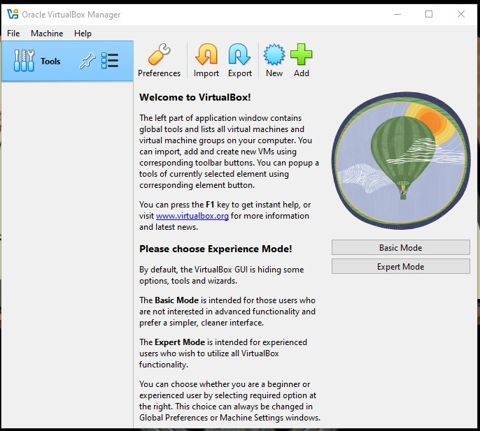
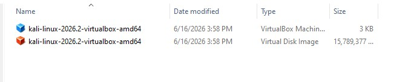
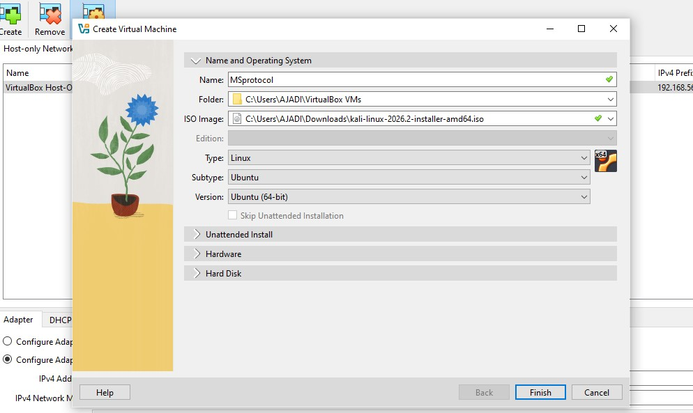
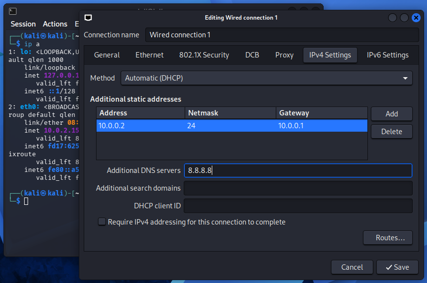
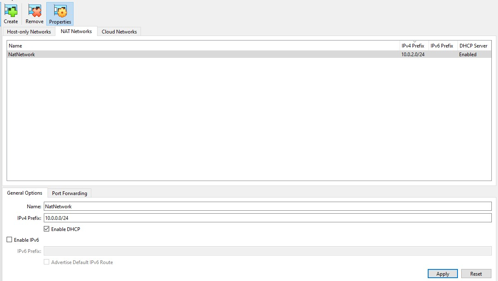
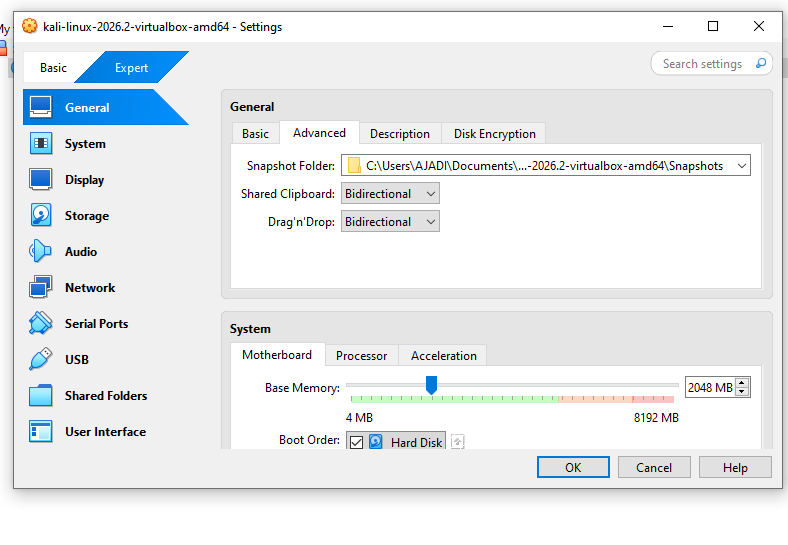
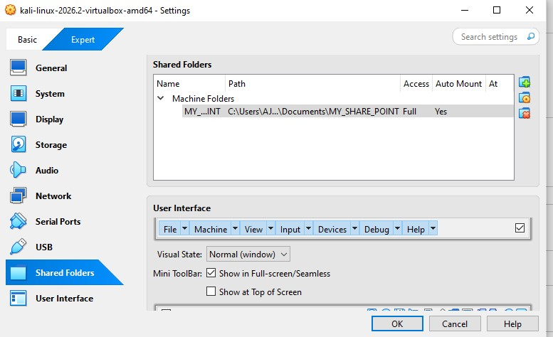
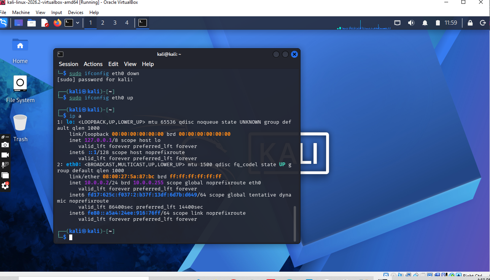
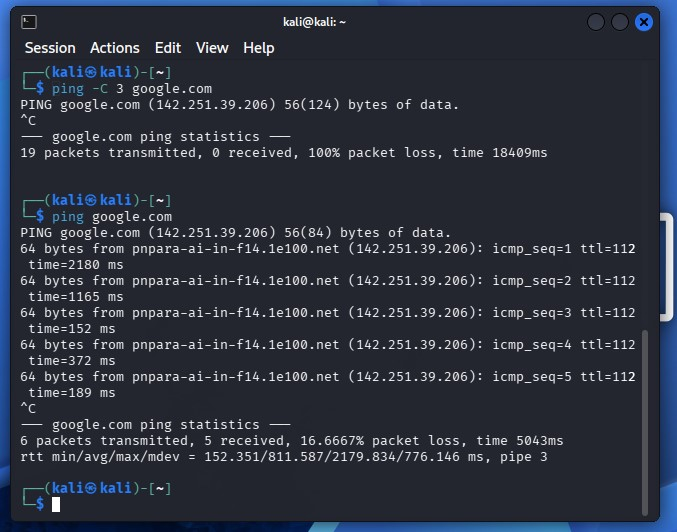
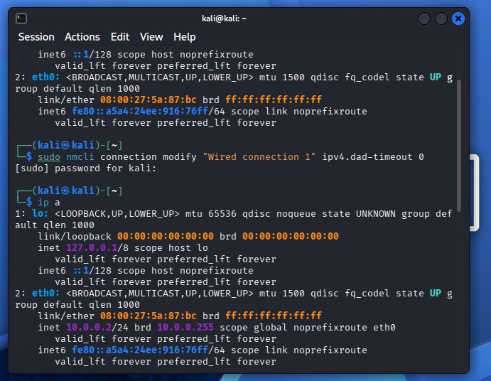

# NETWORKWALKS-EMMANUEL-B083-WK1-PM1-CYBERSECURITY-LAB-SETUP

## Project Overview

This project sets up a virtual cybersecurity and penetration-testing lab using **VirtualBox** and **Kali Linux**.
The environment is designed to be safe, repeatable, and isolated, so reconnaissance, network scanning, vulnerability assessment, and other authorized security-testing activities can be performed without impacting external systems.

The lab uses a private virtual network architecture so additional virtual machines can be added later as targets for controlled testing exercises.

## Objectives

- Install and configure VirtualBox.
- Install or import Kali Linux as a virtual machine.
- Create a private NAT Network for the cybersecurity lab.
- Configure Kali Linux networking within the lab network.
- Assign a consistent IP address to the Kali VM.
- Verify network connectivity and DNS resolution.

## 🛡️ Purpose of the Lab

The lab provides an isolated and controlled environment for cybersecurity learning and authorized security testing.

It can be used for activities such as:

Network reconnaissance
Port scanning
Vulnerability assessment
Packet analysis
Web security testing
Exploitation practice
Security-tool experimentation
⚠️ Important: This laboratory must only be used for systems that you own or have explicit permission to test. Do not use the lab or its tools to attack unauthorized systems.
- Take a clean VM snapshot for recovery and rollback.
- Document the full setup process end to end.
- Prepare the environment for future cybersecurity lab projects.

## Expected Outcome

At completion, the repository documents a working baseline lab setup where Kali Linux is connected to an isolated NAT network, has validated connectivity and DNS, and includes a clean restore snapshot to support repeatable future security exercises.


## Lab Configuration

| 🧩 Component | ⚙️ Configuration |
|---|---|
| 🖥️ Host OS | Windows 10 |
| 🧠 Host RAM | 8 GB |
| ⚡ Processor | Intel Core i5 |
| 🧰 Hypervisor | VirtualBox 7.2 |
| 🐉 Security OS | Kali Linux 2026.2 |
| 🧠 Kali RAM | 2048 MB |
| 🌐 Virtual Network | NAT Network |
| 📡 Network Address | 10.0.0.0/24 |
| 🐧 Kali IP Address | 10.0.0.2/24 |
| 🚪 Default Gateway | 10.0.0.1 |
| 🌍 DNS Server | 8.8.8.8 |
| 🔮 Future VM Range | 10.0.0.3–10.0.0.99 |


## Lab Setup Procedure
## Step 1. Install 7-Zip or WinRAR
WinRAR was installed to extract the Kali Linux virtual-machine package, which may be distributed as an archive.

Tool: WinRAR

## Step 2. Install VirtualBox
VirtualBox was installed as the hypervisor.


## Step 3. Extract kali


## Step 4. Setup Kali Linux as attacking/hacker machine



## Step 5. Setup the network in subnet 10.0.0.0/24



## Step 6. Use NATNetwork with 10.0.0.0/24



## Step 7. The clipboard & file drag/drop should be enabled in Virtual Machine settings



## Step 8. Shared folders should be enabled with /downloads folder shared from host machine



## Step 9. Kali Linux IP Address should be 10.0.0.2/24



## Step 10. Kali Linux should have full Internet access




## 🐞 Problems Encountered & Solutions
Documenting problems is an important part of the project.

Problem 1. Internet Connectivity After Static IP Configuration
After manually configuring the IPv4 settings, Internet connectivity may fail depending on the Kali/NetworkManager configuration.

One workaround used during this lab was:

```` sudo nmcli connection modify "Wired connection 1" ipv4.dad-timeout 0 ````
The network connection was then restarted/rebooted and connectivity was tested again.

Important: Network interface and connection names may differ between systems. Students should first identify their actual connection name before running an nmcli command.


## 💡 What I Learned
Through this project, I learned how to create and configure a virtual environment for cybersecurity practice.

The most important concepts I learned include:

1. NAT vs NAT Network
A standard NAT configuration and a NAT Network serve different purposes.

A NAT Network allows multiple VMs connected to the same virtual network to communicate with one another while providing network address translation for external connectivity.

This makes it useful for building a multi-machine cybersecurity laboratory.

2. Virtual Machine Networking
I learned how VirtualBox virtual network adapters connect virtual machines to different types of networks and how network configuration affects communication between machines.

3. Static IP Configuration
I learned how to configure and verify IPv4 addressing, subnet masks, gateways, and DNS settings in Kali Linux.

4. VM Snapshots
I learned that a clean snapshot should be created before performing risky or experimental activities.

This provides a known-good recovery point for future cybersecurity exercises.

5. Documentation
I learned that documenting commands, configuration, screenshots, problems, and solutions is an important part of a professional cybersecurity project.

## 🔐 Security & Ethical Use
This laboratory is intended strictly for education purposes only.

## 🔗 Tools & Resources
7-Zip: https://7-zip.org/download.html
VirtualBox: https://virtualbox.org/wiki/Downloads
Kali Linux: https://kali.org/get-kali
## 👤 Author
Mohammed Mohammed Sanagri
Cybersecurity Professional B082

LinkedIn: https://www.linkedin.com/in/waqaskarim/

📌 Project Information
Program Name: Cybersecurity at Networkwalks | Week: 01 | Project: Cybersecurity & Pentesting Lab Setup | Repository: GitHub


